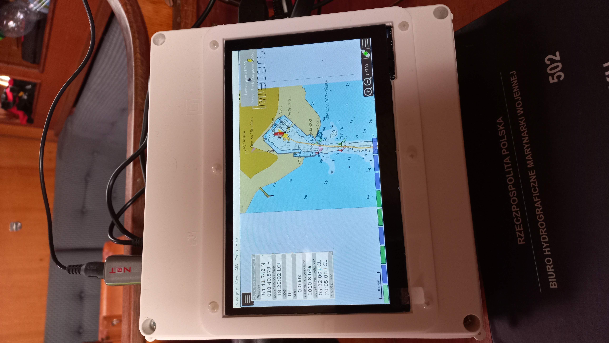
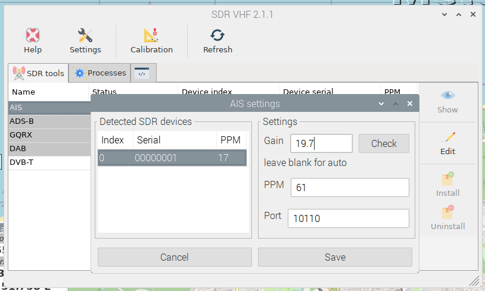
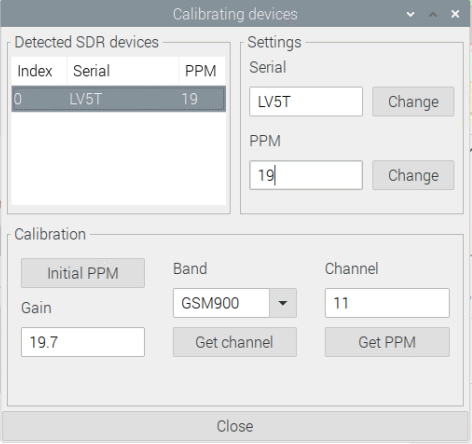

# Alpha version - 2022
- OpenPlotter3
- TouchScreen [Waweshare SKU 11303](https://www.waveshare.com/7inch-hdmi-lcd-c-with-bicolor-case.htm)
- RaspberryPi 3
- maps: o-charts
- sensors: BMP280
- gps: ublox8
- storage: SD card
- power supply: 12V via car plug
- AIS
    - via SDR NotOnlyTV DeLux5 - hight CPU utilization
    - [Quark-Elec QK-A024](https://www.quark-elec.com/product/qk-a024-wireless-ais-receiver/)

