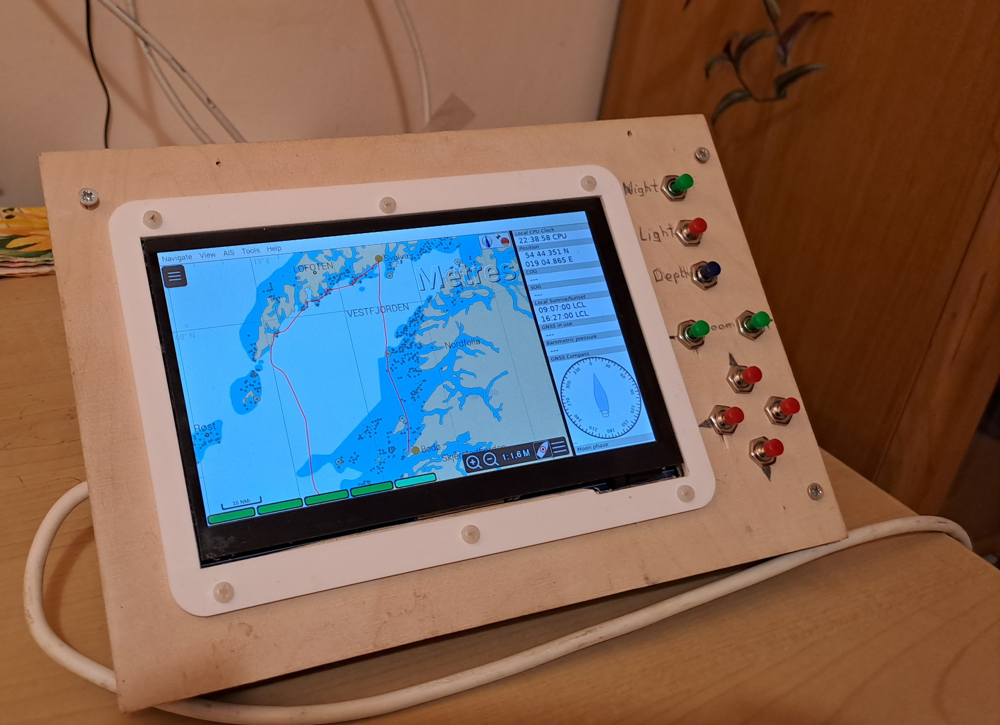

# Beta version - 2024
- OpenPlotter4
- TouchScreen [Waweshare SKU 11303](https://www.waveshare.com/7inch-hdmi-lcd-c-with-bicolor-case.htm)
- RaspberryPi 4
- maps: o-charts
- sensors: BMP280
- gps: ublox8
- storage: SSD 128GB disk via USB3
- power supply: 12V via car plug
- keys via GPIO - to be described later
- AIS:
    - [Quark-Elec QK-A024](https://www.quark-elec.com/product/qk-a024-wireless-ais-receiver/)
    - antenna - coaxial 4m cable with last ca 46cm without shield - perfect range

