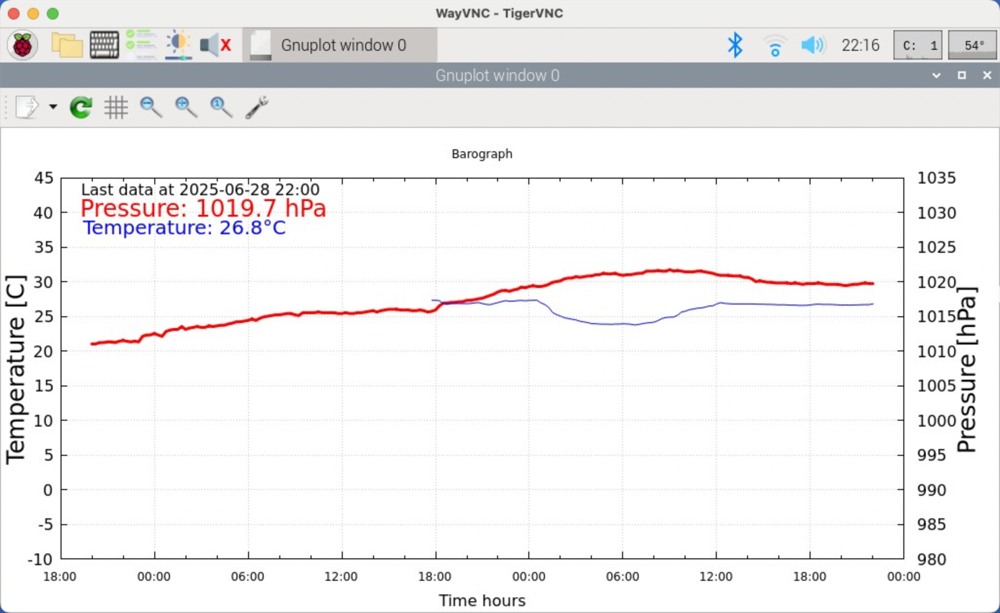

# Barograph

Plot pressure in time. Refresh data every 5 minute, data are aquired every 15 minutes.
Data are aquired by triggered by crontab.
Crontab script keep only last 200 data in log, against pollute storage by huge log.



## Installation

Install gnuplot:
```bash
sudo apt-get install gnuplot-qt
```
Copy files: `barograph.cmd` and `barograph_cron.sh` into `/home/pi/barograph/`

For autostart: copy `barograph.desktop` into `/home/pi/.config/autostart/`

Add execution right:
```
chmod a+x /home/pi/barograph/barograph.cmd
chmod a+x /home/pi/barograph/barograph_cron.sh
```

Add entry into cron:
```bash
crontab -e

*/15 * * * * /home/pi/barograph/barograph_cron.sh
```

## Data source

Pressure sensor - e.g. BMP280.
Data are taken from ([plugin](https://www.npmjs.com/package/signalk-raspberry-pi-bme280)) of
[SignalK](https://signalk.org/).
