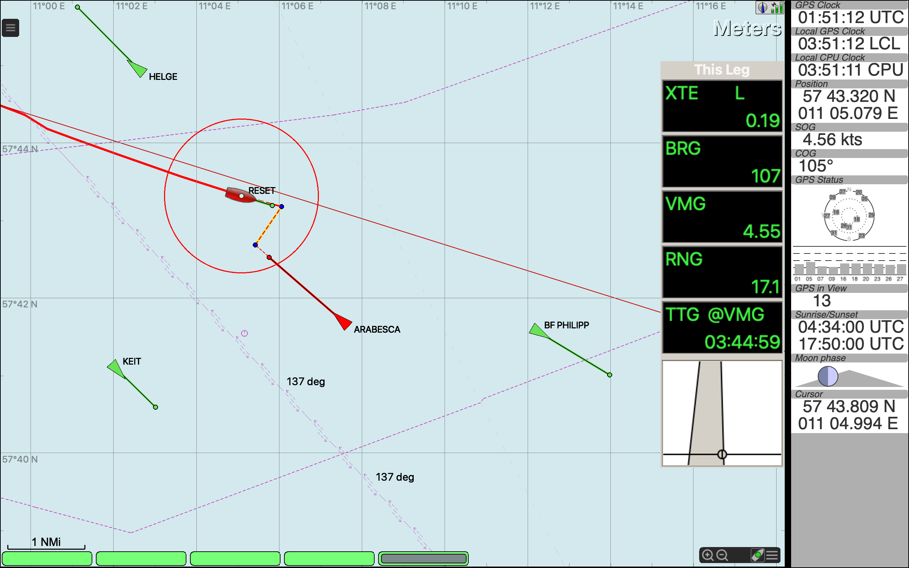

# Navigation apps

## OpenCPN

- charts per country via [o-charts](https://www.o-charts.org/)
- free raster charts [OpenSeaMap](https://wiki.openstreetmap.org/wiki/KAP-charts_from_OpenSeaMap) or direct [Download](https://ftp.gwdg.de/pub/misc/openstreetmap/openseamap/charts/kap/)

## NV Charts App
[Download](https://eu.nvcharts.com/digital-charts/nv-charts-app/)

- MacOS, MS Windows, Android, iOS
- poor configuration - only one network NMEA input
- cheap Baltic Sea chart, but without Denmark and Bornholm
